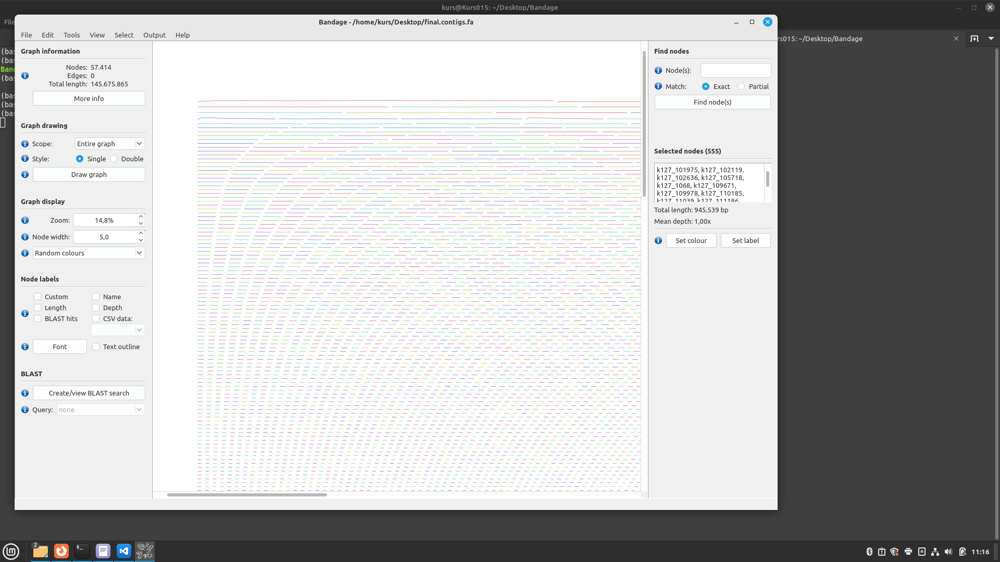

# Day 3

# Question 1

Image of the graph in Bandage




There you can see the contigs of the metagenomic assembly.

There are no bubbles, branches or unresolved ends in the assembly, but many short contigs. 

# Question 2

What is your N50 value? Why is this value relevant?
How many contigs are assembled?
What is the total length of the contigs?

My N50 value is:2963
N50 is the contig length such that using longer or equal length contigs produces half (50%) of the bases of the assembly.Usually there is no value that produces ecactly 50%, so the technical definition is the maximum length x such that using contigs of length at least x accounts for at least 50% of the total assembly length.
(The N50 defines assembly quality in terms of contiguity)

Contigs assembled:57414
The total length is: 145675865


# Some information for me 

In this [link](https://github.com/LBertelson29/biol217/tree/main) you can find github. 
0000

how to connect: 

(base) kurs@Kurs015:~/Documents/github_final/biol217$ git config --global user.name "[LBertelson29]"
(base) kurs@Kurs015:~/Documents/github_final/biol217$ git config --global user.email "[stu212375@mail.uni-kiel.de]"
(base) kurs@Kurs015:~/Documents/github_final/biol217$ 

strg s --> safe


$ less final.contigs.fa
$ less final.contigs.

each contig starts with >

head = first 10 Lines
cat = everything 
less = 
$ 

[sunam228@caucluster2 Day3]$ ls
2_fastp  3_assembly  3_metaquast  4_mapping  5_anvio_profiles
[sunam228@caucluster2 Day3]$ ls
2_fastp  3_coassembly  3_metaquast  4_mapping  5_anvio_profiles
[sunam228@caucluster2 Day3]$ conda activate /home/sunam226/.conda/envs/anvio
(anvio) [sunam228@caucluster2 Day3]$ cd 3_coassembly
(anvio) [sunam228@caucluster2 3_coassembly]$ grep -c ">" final.contigs.fa
grep: final.contigs.fa: No such file or directory
(anvio) [sunam228@caucluster2 3_coassembly]$ grep -c ">" final.contigs.fa
grep: final.contigs.fa: No such file or directory
(anvio) [sunam228@caucluster2 3_coassembly]$ grep -c ">" 
checkpoints.txt       final.contigs.fastg   intermediate_contigs/ log                   name_conversion.txt   
(anvio) [sunam228@caucluster2 3_coassembly]$ grep -c ">" final.contigs.fastg
114828
(anvio) [sunam228@caucluster2 3_coassembly]$ megahit_toolkit contig2fastg 99 final.contigs.fa > final.contigs.fastg                   
(anvio) [sunam228@caucluster2 3_coassembly]$ 

#jetzt kann das in Bandage geladen werden (eine Datei wurde erstellt)


die auf Desktop kopieren 

new Terminal 

dann 

(base) kurs@Kurs015:~$ cd Desktop/Bandage/

./Bandage  --> wird geöffnet


so kopiere ich sachen von einem Ordner in einen anderen und benenne es gleich noch um 

cp ../../day2/0_raw_reads/anviscript ./metaquast


bash-script für day 3

#!/bin/bash
#SBATCH --nodes=1
#SBATCH --cpus-per-task=4
#SBATCH --mem=10G
#SBATCH --time=1:00:00
#SBATCH --job-name=metaquest
#SBATCH --output=metaquest.out
#SBATCH --error=metaquest.err
#SBATCH --partition=all
#SBATCH --reservation=biol217


#load your anvio environment (path needs to be adjusted)

source activate /home/sunam226/miniconda3/miniconda4.9.2/usr/etc/profile.d/conda.sh/envs/anvio-7.1


#navigate to working directory
cd /work_beegfs/sunam228/Day3/3_coassembly


# Batch-script Mapping
```
#!/bin/bash
#SBATCH --nodes=1
#SBATCH --cpus-per-task=4
#SBATCH --mem=10G
#SBATCH --time=1:00:00
#SBATCH --job-name=mapping
#SBATCH --output=mapping.out
#SBATCH --error=mapping.err
#SBATCH --partition=all
#SBATCH --reservation=biol217
```


#load your anvio environment (path needs to be adjusted)

```
source activate /home/sunam226/miniconda3/miniconda4.9.2/usr/etc/profile.d/conda.sh/envs/anvio-7.1
```


#navigate to working directory

```
cd /work_beegfs/sunam228/Day3/4_mapping

bowtie2-build /work_beegfs/sunam228/Day3/3_coassembly/contigs.anvio.fa /work_beegfs/sunam228/Day3/4_mapping/contigs.anvio.fa.index
```

# Batch-script Mapping 2

```
#!/bin/bash
#SBATCH --nodes=1
#SBATCH --cpus-per-task=4
#SBATCH --mem=10G
#SBATCH --time=1:00:00
#SBATCH --job-name=mapping_2
#SBATCH --output=mapping_2.out
#SBATCH --error=mapping_2.err
#SBATCH --partition=all
#SBATCH --reservation=biol217
```


load your anvio environment (path needs to be adjusted)
```
source activate /home/sunam226/miniconda3/miniconda4.9.2/usr/etc/profile.d/conda.sh/envs/anvio-7.1

cd ./2_fastp/
for i in `ls *mapped_R1.fastq.gz`;
do 
    second=`echo ${i} | sed 's/_R1/_R2/g'`
    bowtie2 --very-fast -x ../4_mapping/contigs.anvio.fa.index -1 ${i} -2 ${second} -S ../4_mapping/"$i".sam 
done
```
# Batch-script SAM

```
#!/bin/bash
#SBATCH --nodes=1
#SBATCH --cpus-per-task=4
#SBATCH --mem=10G
#SBATCH --time=1:00:00
#SBATCH --job-name=sam
#SBATCH --output=sam.out
#SBATCH --error=sam.err
#SBATCH --partition=all
#SBATCH --reservation=biol217
```

#load your anvio environment (path needs to be adjusted)

```
source activate /home/sunam226/miniconda3/miniconda4.9.2/usr/etc/profile.d/conda.sh/envs/anvio-7.1


module load samtools

cd ./4_mapping/
for i in *.sam; do samtools view -bS $i > "$i".bam; done

```

