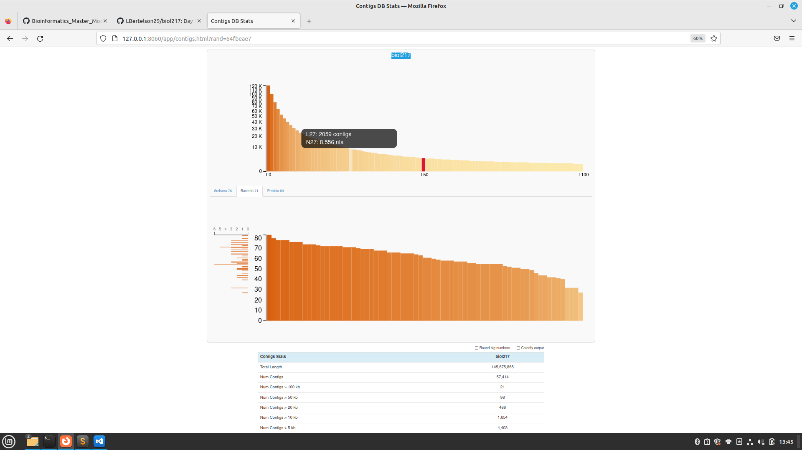
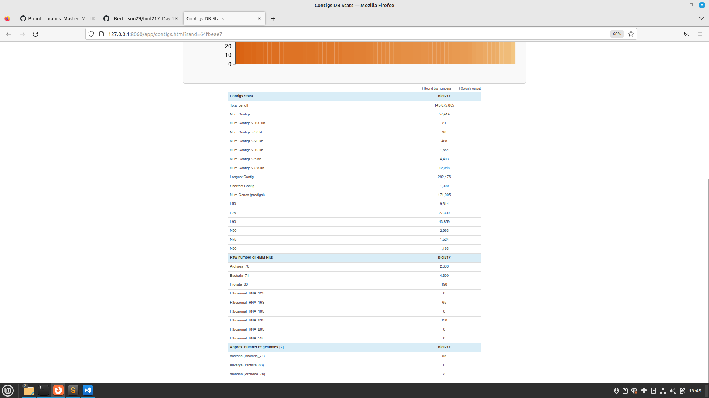

# Day_4

## Contigs data preparation

convqqase = anvi’o contigs-db database that contains key information associated with your sequences

```
anvi-gen-contigs-database -f contigs.anvio.fa -o contigs.db -n 'biol217'
```

### Batch-script for contigs data preparation
```
#!/bin/bash
#SBATCH --nodes=1
#SBATCH --cpus-per-task=4
#SBATCH --mem=10G
#SBATCH --time=1:00:00
#SBATCH --job-name=anvi_contigs
#SBATCH --output=anvi_contigs.out
#SBATCH --error=anvi_contigs.err
#SBATCH --partition=all
#SBATCH --reservation=biol217

#load your anvio environment (path needs to be adjusted)

module load miniconda3/4.7.12.1
source activate /home/sunam225/miniconda3/miniconda4.9.2/usr/etc/profile.d/conda.sh/envs/anvio-7.1

#navigate to working directory
cd /work_beegfs/sunam228/Day3/

anvi-gen-contigs-database -f ./4_mapping/contigs.anvio.fa -o ./5_anvio_profiles/contigs.db -n 'biol217'

``````
When you run this command, anvi-gen-contigs-database will 

   * Compute k-mer frequencies for each contig
  *  Soft-split contigs longer than 20,000 bp into smaller ones
   * Identify open reading frames using Prodigal, the bacterial and archaeal gene finding program


Next `HMM` search on the contigs

`HMM` = "Basically, in anvi’o, `H`idden `M`arkov `M`odels (or HMMs for short) are used to search for specific genes with known functions in a larger dataset"

```
anvi-run-hmms -c contigs.db
```
### Batch-script for HMM

```#!/bin/bash
#SBATCH --nodes=1
#SBATCH --cpus-per-task=4
#SBATCH --mem=10G
#SBATCH --time=1:00:00
#SBATCH --job-name=hmm
#SBATCH --output=hmm.out
#SBATCH --error=hmm.err
#SBATCH --partition=all
#SBATCH --reservation=biol217

#load your anvio environment (path needs to be adjusted)

module load miniconda3/4.7.12.1
source activate /home/sunam225/miniconda3/miniconda4.9.2/usr/etc/profile.d/conda.sh/envs/anvio-7.1

#navigate to working directory
cd /work_beegfs/sunam228/Day3/

anvi-run-hmms -c ./5_anvio_profiles/contigs.db
```

Once you have your contigs database ready, and optionally your HMMs are run, you can take a quick look at it using the program `anvi-display-contigs-stats`


### First you need to access anvi’o interactive 


To access (everytime) : 
```
 srun --pty --mem=10G --nodes=1 --tasks-per-node=1 --cpus-per-task=1 --partition=all /bin/bash
```
  - `node068` - (remember!)
```
source activate /home/sunam225/miniconda3/miniconda4.9.2/usr/etc/profile.d/conda.sh/envs/anvio-7.1

anvi-display-contigs-stats contigs.db
```

`Open new Terminal`

```
ssh -L 8060:localhost:8080 sunam###@caucluster.rz.uni-kiel.de
```
```
ssh -L 8080:localhost:8080 node###
```
`Open google chrome and paste`

http://0.0.0.0:8081

http://127.0.0.1:8060 or http://127.0.0.1:8080 (Remenber your server information)

This program shows you simple stats of your contigs database that may help you not only assess your assembly output, but also estimate the number of bacterial and archaeal genomes to recover.





# Binning with Anvi´o

`ANVI´O`, an `AN`alysis and `VI`sualization platform for microbial ´`O`mics

“anvi’o is a comprehensive platform that brings together many aspects of today’s cutting-edge computational strategies of data-enabled microbiology, including genomics, metagenomics, metatranscriptomics, pangenomics, metapangenomics, phylogenomics, and microbial population genetics in an integrated and easy-to-use fashion through extensive interactive visualization capabilities.”

## Sort and Index .bam files
### Batch-script sort/index .bam

```
for i in *.bam; do anvi-init-bam $i -o "$i".sorted.bam; done
```
```
#!/bin/bash
#SBATCH --nodes=1
#SBATCH --cpus-per-task=4
#SBATCH --mem=10G
#SBATCH --time=1:00:00
#SBATCH --job-name=anvio_binning
#SBATCH --output=anvio_binning.out
#SBATCH --error=anvio_binning.err
#SBATCH --partition=all
#SBATCH --reservation=biol217

#load your anvio environment (path needs to be adjusted)

module load miniconda3/4.7.12.1
source activate /home/sunam225/miniconda3/miniconda4.9.2/usr/etc/profile.d/conda.sh/envs/anvio-7.1

#navigate to working directory
cd /work_beegfs/sunam228/Day3/4_mapping/

for i in *.bam; do anvi-init-bam $i -o ../5_anvio_profiles/"$i".sorted.bam; done
```
## Creating an Anvi’o profile

An anvi’o profile stores sample-specific information about contigs. Profiling a BAM file with anvi’o using anvi-profile creates a single profile that reports properties for each contig in a single sample based on mapping results.

```mkdir /PATH/TO/profiling/
for i in `ls *.sorted.bam | cut -d "." -f 1`; do anvi-profile -i "$i".bam.sorted.bam -c contigs.db -o /PATH/TO/profiling/”$i”; done
```
This command line will return a folder where you will find the following files:

- RUNNLOG.txt the anvi´o log of your run
- PROFILE.db An anvi’o database that contains key information about the mapping of short reads from multiple samples to your contigs

Processing of contigs will include:

- The recovery of mean coverage, standard deviation of coverage, and the average coverage for the inner quartiles (Q1 and Q3) for a given contig.
- The characterization of single-nucleotide variants (SNVs) for every nucleotide position. By default, the profiler will not pay attention to any nucleotide position with less than 10X coverage.
- Finally, because single profiles are rarely used for genome binning or visualization, and since the clustering step increases the profiling runtime for no good reason, the default behavior of profiling is to not cluster contigs automatically.
  

### Batch-script for Anvi'o profile
```
#!/bin/bash
#SBATCH --nodes=1
#SBATCH --cpus-per-task=4
#SBATCH --mem=10G
#SBATCH --time=1:00:00
#SBATCH --job-name=anvio_profile
#SBATCH --output=anvio_profile.out
#SBATCH --error=anvio_profile.err
#SBATCH --partition=all
#SBATCH --reservation=biol217

#load your anvio environment (path needs to be adjusted)

module load miniconda3/4.7.12.1
source activate /home/sunam225/miniconda3/miniconda4.9.2/usr/etc/profile.d/conda.sh/envs/anvio-7.1

#navigate to working directory
cd /work_beegfs/sunam228/Day3/

mkdir ./profiling/
cd ./5_anvio_profiles/
for i in `ls *.sorted.bam | cut -d "." -f 1`; do anvi-profile -i "$i".bam.sorted.bam.sorted.bam -c ./contigs.db -o ../profiling/$i; done
```


### Next step: merge the profiles coming from your different samples into one profile


```
anvi-merge /PATH/TO/SAMPLE1/PROFILE.db /PATH/TO/SAMPLE2/PROFILE.db /PATH/TO/SAMPLE3/PROFILE.db -o /PATH/TO/merged_profiles -c /PATH/TO/contigs.db --enforce-hierarchical-clustering
```
When you runanvi-merge:

   - It will merge everything and create a merged profile
   - It will attempt to create multiple clusterings of your splits using the default clustering configurations.

### Batch-script merging
```
#!/bin/bash
#SBATCH --nodes=1
#SBATCH --cpus-per-task=4
#SBATCH --mem=10G
#SBATCH --time=1:00:00
#SBATCH --job-name=merge
#SBATCH --output=merge.out
#SBATCH --error=merge.err
#SBATCH --partition=all
#SBATCH --reservation=biol217

#load your anvio environment (path needs to be adjusted)

module load miniconda3/4.7.12.1
source activate /home/sunam225/miniconda3/miniconda4.9.2/usr/etc/profile.d/conda.sh/envs/anvio-7.1

#navigate to working directory
cd /work_beegfs/sunam228/Day3/

anvi-merge ./6_profiling/BGR_130305/PROFILE.db ./6_profiling/BGR_130527/PROFILE.db ./6_profiling/BGR_130708/PROFILE.db -o ./6_profiling/merged_profiles -c ./5_anvio_profiles/contigs.db --enforce-hierarchical-clustering
```

## Genome binning 

Basically, in metagenomic binning, you’re trying to group together a bunch of contigs that all belong to the same genome using various metrics like tetranucleotide frequency, differential coverage, completion, etc .“

`Here you are going to use Metabat2 and CONCOCT, two binners then use DAS_Tool to choose the best bins.`

### Binning with Metabat2

```
anvi-cluster-contigs -p merged_profiles/PROFILE.db -c /PATH/TO/contigs.db -C METABAT --driver metabat2 --just-do-it --log-file log-metabat2

anvi-summarize -p merged_profiles/PROFILE.db -c /PATH/TO/contigs.db -o SUMMARY_METABAT -C METABAT
```
### Binning with CONCOCT

```
anvi-cluster-contigs -p merged_profiles/PROFILE.db -c /PATH/TO/contigs.db -C CONCOCT --driver concoct --just-do-it

anvi-summarize -p merged_profiles/PROFILE.db -c /PATH/TO/contigs.db -o SUMMARY_CONCOCT -C CONCOCT
```
### Consolidating bins with DASTool
```
anvi-cluster-contigs -p merged_profiles/PROFILE.db -c /PATH/TO/contigs.db -C consolidated_bins --driver dastool -T 20 --search-engine diamond -S METABAT,CONCOCT --log-file log_consolidation_of_bins --just-do-it

anvi-summarize -p merged_profiles/PROFILE.db -c /PATH/TO/contigs.db -o /PATH/TO/SUMMARY_consolidated_bins -C consolidated_bins
```

## `Questions`

Number of Archaea bins you got from MetaBAT2? 
- 3

Number of Archaea bins you got from CONCOCT? 
- 2

Number of Archaea bins you got after consolidating the bins?
- 2

# MAGs Quality Estimation
Estimate your genomes completeness and contamination levels.
You can assess the quality of your bins by using
```
anvi-estimate-genome-completeness -c /PATH/TO/contigs.db -p merged_profiles/PROFILE.db -C consolidated_bins
```
### Visualizing and evaluating the results 

To check what collections you generated you can use:

```
 anvi-estimate-genome-completeness -p merged_profiles/PROFILE.db -c /PATH/TO/contigs.db --list-collections
 ```

 ### `Open anvi'o interactive`

```
srun --pty --mem=10G --nodes=1 --tasks-per-node=1 --cpus-per-task=1 --partition=all /bin/bash
```
- node### -
```
conda activate /home/sunam225/miniconda3/miniconda4.9.2/usr/etc/profile.d/conda.sh/envs/anvio-7.1

anvi-interactive -p merged_profiles/PROFILE.db -c /PATH/TO/contigs.db -C YOUR_COLLECTION
```
`Open New Terminal`
```
ssh -L 8060:localhost:8080 sunam###@caucluster-old.rz.uni-kiel.de
```
```
ssh -L 8080:localhost:8080 node###
```

`Open google chrome and paste`

http://127.0.0.1:8060 or http://127.0.0.1:8080


Anvi-interactive gives you the possibility to manually inspect and work on bins.
- you can set all parameters that you want 

```
anvi-interactive -p ./PROFILE.db -c ./contigs.db -C ../../consolidated_bins
```
(Code not tested)


Then Click on draw (bottom left corner)


## `Questions`

Which binning strategy gives you the best quality for the bins?

How many bins do you get that are of High Quality? 

How many bins do you get that are of High Quality?


