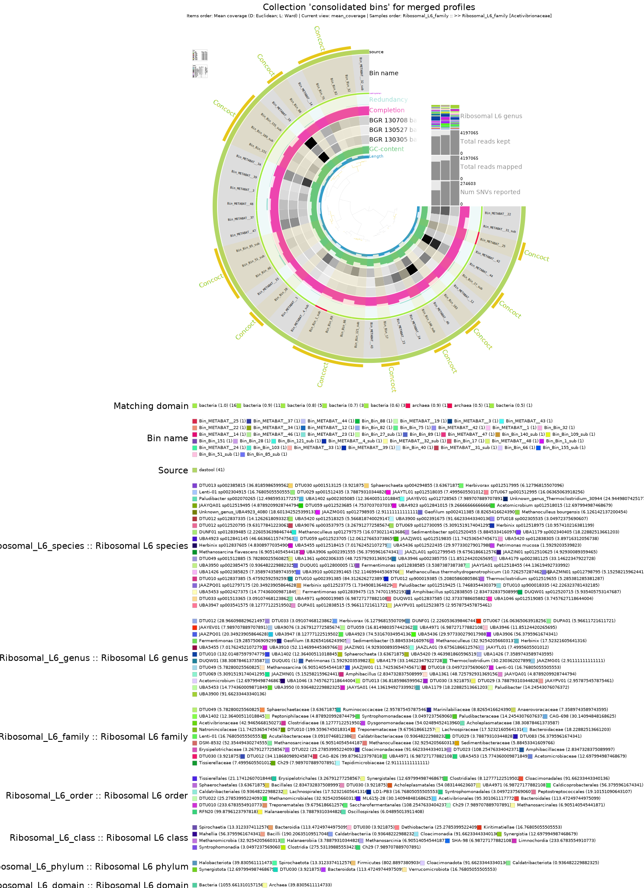
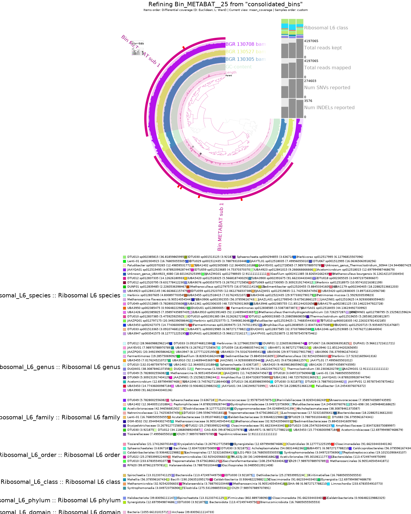

# Day 5
# MAGs Quality Estimation

## Visualizing and evaluating the results 

Estimate your genomes completeness and contamination levels.
You can assess the quality of your bins by using
```
anvi-estimate-genome-completeness -c /PATH/TO/contigs.db -p merged_profiles/PROFILE.db -C consolidated_bins
```
`For my path`

```
anvi-estimate-genome-completeness -c ./contigs.db -p ./5_anvio_profiles/merged_profiles/PROFILE.db -C consolidated_bins
```
```
anvi-estimate-genome-completeness -c ./contigs.db -p ./5_anvio_profiles/merged_profiles/PROFILE.db -C consolidated_bins > genome_completeness_das
tool-txt
```
--> for saving the list 


To check what collections you generated you can use:

```
 anvi-estimate-genome-completeness -p merged_profiles/PROFILE.db -c /PATH/TO/contigs.db --list-collections
 ```
`For my path` 
```
anvi-estimate-genome-completeness -p ./5_anvio_profiles/merged_profiles/PROFILE.db -c ./contigs.db --list-collections
```


COLLECTIONS FOUND

* METABAT (48 bins, representing 8939 items).
* CONCOCT (156 bins, representing 57626 items).
* consolidated_bins (41 bins, representing 13825 items).


 ### `Open anvi'o interactive`

```
srun --pty --mem=10G --nodes=1 --tasks-per-node=1 --cpus-per-task=1 --partition=all /bin/bash
```
- node077 -
```
conda activate /home/sunam225/miniconda3/miniconda4.9.2/usr/etc/profile.d/conda.sh/envs/anvio-7.1

anvi-interactive -p ./5_anvio_profiles/merged_profiles/PROFILE.db -c ./contigs.db -C METABAT
```
`Open New Terminal`
```
ssh -L 8060:localhost:8080 sunam228@caucluster-old.rz.uni-kiel.de
```
```
ssh -L 8080:localhost:8080 node077
```

`Open google chrome and paste`

http://127.0.0.1:8060 or http://127.0.0.1:8080


Anvi-interactive gives you the possibility to manually inspect and work on bins.
- you can set all parameters that you want 




## `Questions` 


Which binning strategy gives you the best quality for the Archaea bins?

How many Archaea bins do you get that are of High Quality? 


# Bin refinement 

First, active conda 
```
conda activate /home/sunam225/miniconda3/miniconda4.9.2/usr/etc/profile.d/conda.sh/envs/anvio-7.1
```

Then use anvi-summarize as displayed below.
```
anvi-summarize -c /PATH/TO/contigs.db -p /PATH/TO/merged_profiles/profile.db -C consolidated_bins -o SUMMARY --just-do-it
```

### Batch-script for anvio_summarize
```
#!/bin/bash
#SBATCH --nodes=1
#SBATCH --cpus-per-task=4
#SBATCH --mem=10G
#SBATCH --time=1:00:00
#SBATCH --job-name=anvi_summarize
#SBATCH --output=anvi_summarize.out
#SBATCH --error=anvi_summarize.out
#SBATCH --partition=all
#SBATCH --reservation=biol217

#load your anvio environment (path needs to be adjusted)

module load miniconda3/4.7.12.1
source activate /home/sunam225/miniconda3/miniconda4.9.2/usr/etc/profile.d/conda.sh/envs/anvio-7.1

#navigate to working directory
cd /work_beegfs/sunam228/Day5/5_anvio_profiles

anvi-summarize -c ../contigs.db -p ./merged_profiles/PROFILE.db -C consolidated_bins -o ./summary --just-do-it
```


As each bin is stored in its own folder, use
```
cd /PATH/TO/SUMMARY/bin_by_bin

mkdir ../../ARCHAEA_BIN_REFINEMENT

cp /PATH/TO/BIN_FOLDER_INFO_FROM_ERR_FILE/*.fa /PATH/TO/ARCHAEA_BIN_REFINEMENT/o-it
```
`For my path`
```
cd ./summary/bin_by_bin

mkdir ../../ARCHAEA_BIN_REFINEMENT

cp ./summary/bin_by_bin/Bin_Bin_1_sub/*.fa ./ARCHAEA_BIN_REFINEMENT/

cp ./summary/bin_by_bin/Bin_METABAT__25/*.fa ./ARCHAEA_BIN_REFINEMENT/

```


## Use GUNC to check run chimera detection.

Genome UNClutter (GUNC) is “a tool for detection of chimerism and contamination in prokaryotic genomes resulting from mis-binning of genomic contigs from unrelated lineages.”

Chimeric genomes are genomes wrongly assembled out of two or more genomes coming from separate organisms. For more information on GUNC: https://genomebiology.biomedcentral.com/articles/10.1186/s13059-021-02393-0

to use GUNC , activate the following environment:
```
conda activate /home/sunam226/.conda/envs/gunc
```
Use the following loop to process all your files in one run:
```
cd /PATH/TO/ARCHAEA_BIN_REFINEMENT

mkdir GUNC
```

### Batch-script for GUNG
```

```


## `Questions`

Do you get bins that are chimeric?
- The Metabat-bins are non-chimeric 
- The Concoct-bins from kingdom to class are chimeric

In your own words (2 sentences max), explain what is a chimeric bin:
  - chimeric contigs: Wrongly assembled contigs from genomic fragments.
  - chimeric bins: contigous fragments from different sources are sorted in the same genomic bin 


## Manual bin refinement

As large metagenome assemblies can result in hundreds of bins, pre-select the better ones for manual refinement, e.g. > 70% completeness.

Before you start, make a copy/backup of your unrefined bins the ARCHAEA_BIN_REFINEMENT.

```
conda activate /home/sunam225/miniconda3/miniconda4.9.2/usr/etc/profile.d/conda.sh/envs/anvio-7.1
```

Use anvi refine to manually work on your bins. “In the interactive interface, any bins that you create will overwrite the bin that you originally opened. If you don’t provide any names, the new bins’ titles will be prefixed with the name of the original bin, so that bin will continue to live on in spirit. Essentially, it is like running anvi-interactive, but disposing of the original bin when you’re done.”


`activate anvi'o interavtive`
```
srun --reservation=biol217 --pty --mem=10G --nodes=1 --tasks-per-node=1 --cpus-per-task=1 --nodelist=node002 /bin/bash
```
* node010

```
conda activate /home/sunam225/miniconda3/miniconda4.9.2/usr/etc/profile.d/conda.sh/envs/anvio-7.1

anvi-refine -c ../contigs.sb -C consolidated_bins -p ./merged_profiles/PROFILE.db --bin-id Bin_METABAT__25
```
`Open new terminal`

```
ssh -L 8060:localhost:8080 sunam228@caucluster-old.rz.uni-kiel.de
ssh -L 8080:localhost:8080 node010
```

`open google chrome and paste `

```
http://127.0.0.1:8060 or http://127.0.0.1:8080
```
### Sort your bins by GC content, by coverage or both
The interface allows you to categorize contigs into separate bins (selection tool)

- Unhighlighted contigs are removed when the data is saved

- Evaluate taxonomy and duplicate single copy core genes

- Remove contigs

For refinement use clustering based on only differential coverage, and then only based on sequence composition in search for outliers


## `Questions`

Does the quality of your Archaea improve?
- The completeness of the bins decreases (from 97.4 to 93.4) 
- The strain heterogeneity stays the same
  
  
hint: look at completeness, strain heterogeneity 

## Table + output Figure



### Notes 

`clade_separation_score` close to 1 = chimeric 

reference-representive -score = how mixed are the genes

metabat= most bins are 0 or near 0 (non-chimeric)

Concoct = only seperated at order-level
metabat= seperated at species-level

