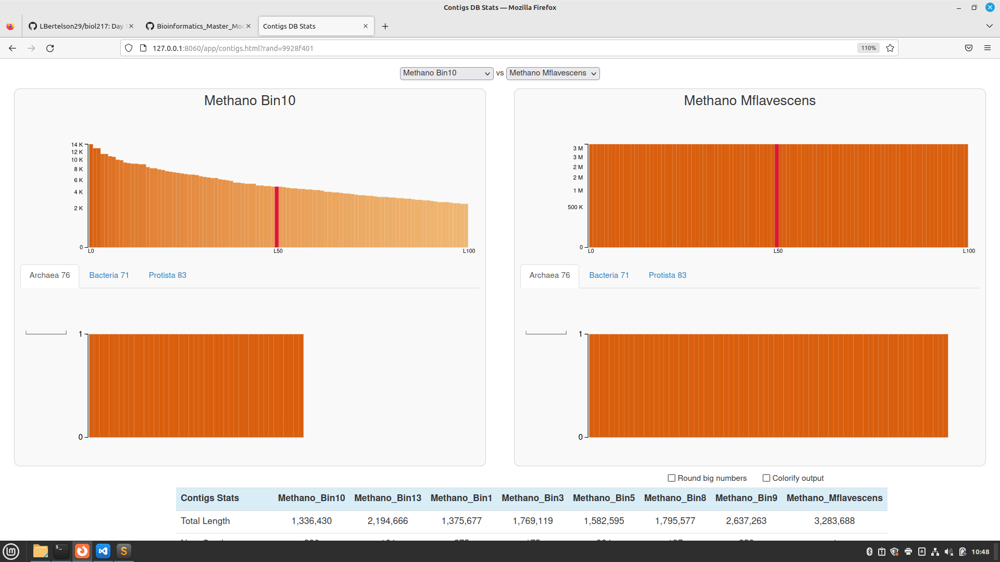
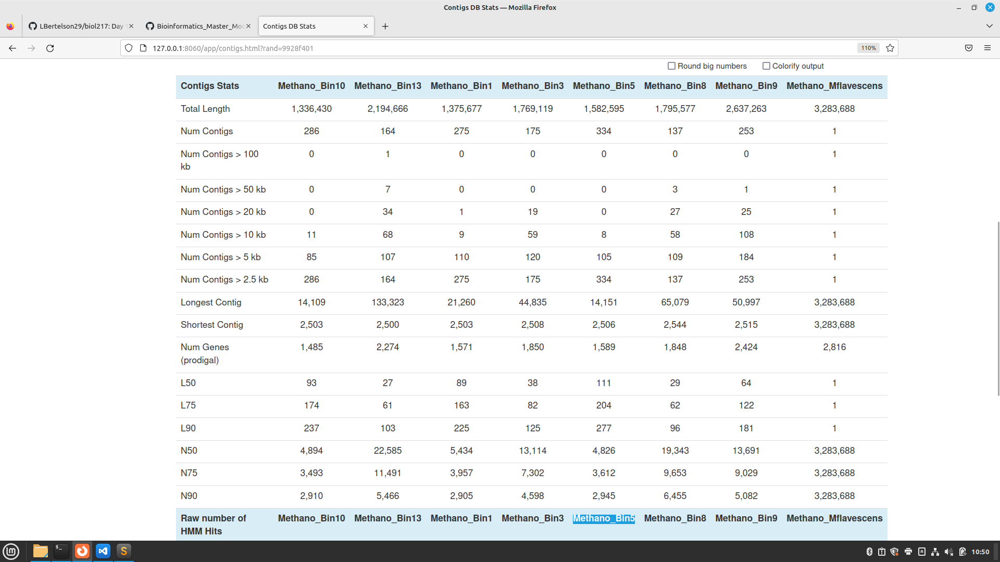
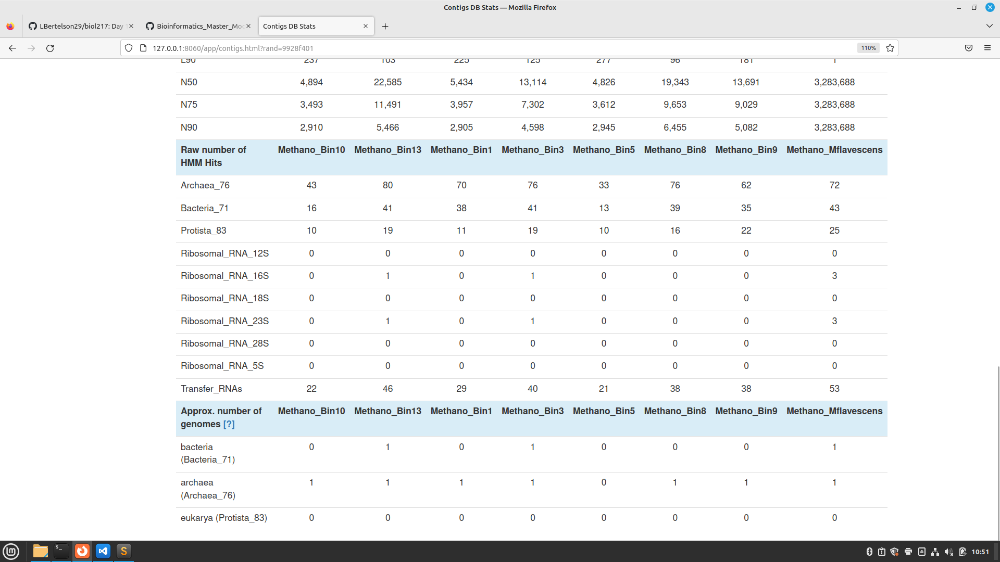

# Day 6

# Pangenomics - comparing genomes


In this tutorial we will combine both the previously assembled MAGs and reference genomes for a phylogenetic and functional genome comparison. This tutorial follows the workflow of the anvi'o miniworkshop and the pangenomics workflow.

Workflow:

- Recap on the Batch Script
- Evaluating the contigs databases
- Create pangenome from individual bins/genomes
- Compare the data phylogenetically (ANI)
- Visualizing the pangenome
- Interpreting and ordering the pangenome
- BONUS: BlastKoala

Folder Structure: 02_contigs-dbs, 03_pangenome

Program or Database 	      Function

anvi'o = Wrapper for genome comparissons

DIAMOND = creates high-throughput protein alignments

pyANI = calculates genome similarities based on average nucleotide identity

BlastKOALA = Onlinetool which creates metabolic networks for a given genome, based on the KEGG database

KEGG = Kyoto Encyclopaedia of Genes and Genomes (Database)

NCBI COG = Clusters of Orthologous Genes (Database)


## 1. A recap on the batch script and for loops

To create a batch script copy the dummy from here, or one of your older scripts

cp ....sh .

The batch script should contain:

1. The shebang
2. Processing requirements as #SBATCH commands
    - Reservation
    - Nodes to use
    - CPUs (for multithreading)
    - memory requirements
    - time
    - working directory
    - log files
    - partitions
3. Stdin and Stderr paths
4. Slurm modules needed for the task
5. The command
6. jobinfo

```
#!/bin/bash

#SBATCH --nodes=1
#SBATCH --cpus-per-task=8
#SBATCH --mem=5G
#SBATCH --time=1:30:00

#SBATCH -D ./
#SBATCH --output=./3_fasta-for-anvio.out
#SBATCH --error=./3_fasta-for-anvio.out
#SBATCH --partition=all

# for pangenome
conda activate /home/sunam225/miniconda3/miniconda4.9.2/usr/etc/profile.d/conda.sh/envs/anvio-7.1

# set working directory by navigating there
cd ....

# Insert your command here


# provides information on resource requirements as stdout
jobinfo
```

# Start of Pangenomics

## 2. Evaluation of our starting databases 
### (Directory: 02_contigs-dbs)


New set of contigs.dbs
They contain:
- MAGs from the Biogasreactor
-  and a complete Methanogen Genome

In order to get us started we will visualize and compare these bins in a summary overview.


This is done with the function:
```
#get direct access to a HPC compute node
srun --reservation=biol217 --pty --mem=10G --nodes=1 --tasks-per-node=1 --cpus-per-task=1 /bin/bash

#activate the conda environment
conda activate /home/sunam225/miniconda3/miniconda4.9.2/usr/etc/profile.d/conda.sh/envs/anvio-7.1

# start anvi'o interactive display
anvi-display-contigs-stats *db
```
`Open new Terminal`
```
ssh -L 8060:localhost:8080 sunam228@caucluster-old.rz.uni-kiel.de
ssh -L 8080:localhost:8080 node010
```
`Open a chrome browser` and enter the following IP. http://127.0.0.1:8060

Task: Take some time to click through the views and compare the MAGs. 
Add a screenshot of your output to your documentation. 





## `Question`
### How do the MAGs compare in size and number of contigs to the full genome?

-The size of MAGs differ in compare to the full genome trough all bins. The size of the MAGs are smaller than the full Methano_mflavenscens genome.
-The number of contigs is much higher in the MAG bins (164 to 334), since the full genome only cosists of 1 contig.
-The longest contigs vary between 14 kb and 65 kb, compared to 3.28 mb of the full genome of Methano_mflavenscens.
-Single copy core genes (HMM) differ from 43 to 80. the complete genome contains 72. 


### Based on the contig numbers, sizes and number of marker genes (HMM hits), which two MAGs are the best:

based on contig number : Methano_Bin13 & Methano_Bin8 (lowest contig numbers)

based on size : Methano_Bin13 & Methano_Bin9 (highest size)

based on number of marker genes : Methano_Bin13 & Methano_Bin3 / Methano_Bin8 (most identical HMM hits)

Methano_bin13 and Metano_bin09 (highest size)
### and which is the worst?
based on contig number : Methano_Bin5 (highest contig number)

based on size : Methano_Bin10 (smallest size)

based on number of marker genes : Methano_Bin5 least identical HMM hits)


When done, close the window and ```Ctrl+C``` in the command lines and ```exit```

# 3. Making a Pangenome 
## (Directory: 03_pangenome)

A pangenome visualizes entire genomes for comparisson.

It can show essential and accessory gene clusters, phylogenetic relationships and genome qualities.

## 3.1 Create an external genomes file

To tell the programm which genomes and MAGs it should use, we will create the "external genomes file".

The external genomes file contains one column with the genome/bin name and one with its path (where it is saved).

We already have a folder with all the genome databases we want to compare (02_contigs-dbs). Anvi'o has a script to create the input information for us:

TASK: Complete the following line, and use it on the login node.

```
anvi-script-gen-genomes-file --input-dir ? -o external-genomes.txt
```

My line: 
```
anvi-script-gen-genomes-file --input-dir ../02_contigs-dbs -o external-genomes.txt
```

Now look into your file to verify whether it looks accurate.

`Tip` use cat or head
 - cat: First 10 lines
 - tail: last 10 lines

## `Output`

# 3.2 Estimate genome completeness

To avoid any nasty suprises by adding a bad bin or incomplete genome to the pangenome, estimate genome completeness. This will give you information on the quality of your MAGs and genomes.

Question: The command provides its output as a table to the standard output of the terminal. What can you add to the code to direct output to, e.g. a .txt file?

```
anvi-estimate-genome-completeness -e external-genomes.txt > genome-completeness.txt
```
We want to specifically look at redundancy and completeness.

## `Question`
How do the bins compare to isolate genomes? Would you remove one, based on the output of the completeness estimation?
- Some bins deviate  greatly to the isolate genome. I would remove Methano_Bin5 and Methano_Bin10 based on the completeness estimation. 

# 3.3 Remove unwanted genomes (Directory: 02_contigs-dbs)

As we have some MAGs with a low completion, we will remove them from our pangenome. Common practice is, to consider only genomes with > 70% completion and < 10% redundancy.

For this go back to 02_contig-dbs, create a new directory "discarded" and mv the "bad MAGs_dbs" to this folder.

```
mkdir discarded
```
```
mv /work_beegfs/sunam228/Day6/02_contigs-dbs/Bin10.db discarded
mv /work_beegfs/sunam228/Day6/02_contigs-dbs/Bin5.db discarded
```
Return to 03_pangenome and recreate the external genomes file.

```
anvi-script-gen-genomes-file --input-dir ? -o external-genomes-final.txt
```
`My line`
```
anvi-script-gen-genomes-file --input-dir ../02_contigs-dbs/ -o external-genomes-final.txt
```
# 3.4 Creating the pangenome database 
## (Directory: 03_pangenome)

In anvi'o we will need to generate two artifacts, similar to when working with assemblies. The first is the genomes-storage.db, which corresponds to an individual contigs.db, but merges all individual genomes you are working with into one database. The files themselves will be a bit leaner, than all files together, making it easier to share and publish those.

The database contains:

1. all genome fasta files
2. the gene annotations (HMMs, SCGs) which were added before
3. any new annotations and genome comparisons we will make

The second file is the pan-genome.db. It is similar to the profile you generate to annotate your bins.

This will contain:

1. genome similarities based on gene amino acid sequences.
2. resolved gene clusters
3. any post-analysis of gene clusters, downstream analyses and visualisations

We will combine the next two steps in one BATCH script with the following computing requirements:

`change SBATCH Settings`: --nodes=1, --cpus-per-task=10, --mem=500M, --time=00:05:00

Look for the following commands and settings and complete this in your batch script:
 ```
 anvi-gen-genomes-storage -e ? -o ?

anvi-pan-genome -g ? --project-name ? --num-threads 10
```
My Batch-script: 
```
#!/bin/bash

#!/bin/bash

#SBATCH --nodes=1
#SBATCH --cpus-per-task=10
#SBATCH --mem=500M
#SBATCH --time=00:05:00
#SBATCH --job-name=pangenome_database
#SBATCH -D ./
#SBATCH --output=./pangenome_database.out
#SBATCH --error=./pangenome_database.out
#SBATCH --partition=all

# for pangenome
source activate /home/sunam225/miniconda3/miniconda4.9.2/usr/etc/profile.d/conda.sh/envs/anvio-7.1

# set working directory by navigating there
cd /work_beegfs/sunam228/Day6/03_pangenome

anvi-gen-genomes-storage -e external-genomes-final.txt -o ./Methano_GENOMES.db

anvi-pan-genome -g Methano_GENOMES.db --project-name Methano_pangenome --num-threads 10
```


# 4. Genome similarity based on average nucleotide identity (ANI) 
## (Directory: 03_pangenome)

The next step calculates the genome similarity to each other. The most commonly used approach is average nucleotide identity using the MUMmer algorithm to align each genome. The result of this is used as a measure to determine how related the genomes are and whether you have discovered a new species. Usually the cutoff for the species boundary is set at 95-96% identity over a 90% genome coverage [Ciufo, et al., 2018; Jain, et al. (2018)].

Once anvi'o has calculated the genome similarity, you can use its output to organize your genomes based on their relatedness.

Depending on the amount of genomes you are using, this step can be quite memory intensive.

Find out what the following parameters mean and complete the command in a BATCH script:

`SBATCH Settings`: --nodes=1, --cpus-per-task=10, --mem=600M, --time=00:02:00
```
anvi-compute-genome-similarity --external-genomes ? --program ? --output-dir ? --num-threads ? --pan-db ?
```
`My SBATCH-script`
```
#!/bin/bash

#SBATCH --nodes=1
#SBATCH --cpus-per-task=10
#SBATCH --mem=600M
#SBATCH --time=00:02:00
#SBATCH --job-name=ANI
#SBATCH -D ./
#SBATCH --output=./ANI.out
#SBATCH --error=./ANI.out
#SBATCH --partition=all

# for pangenome
source activate /home/sunam225/miniconda3/miniconda4.9.2/usr/etc/profile.d/conda.sh/envs/anvio-7.1

# set working directory by navigating there
cd /work_beegfs/sunam228/Day6/03_pangenome

anvi-compute-genome-similarity --external-genomes external-genomes-final.txt --program pyANI --output-dir ANI  --num-threads 10 --pan-db ./Methano_pangenome/Methano_pangenome-PAN.db
```
# 5. Visualizing the pangenome 
## (Directory: 03_pangenome)

`Tip`: When we are working in the interface, we may want to save the changes we have made to the views. This can easily be done via the save buttons. Make sure to give your state a significant name, i.e. the step you are at.

`First get direct access to a HPC compute node`:

```
srun --pty --mem=10G --nodes=1 --tasks-per-node=1 --cpus-per-task=1 --reservation=biol217 --partition=all /bin/bash

#activate the conda environment
conda activate /home/sunam225/miniconda3/miniconda4.9.2/usr/etc/profile.d/conda.sh/envs/anvio-7.1
```

`Check out the pangenome command`:
```
anvi-display-pan -h
```

## `Questions`

### Which INPUT FILES do we need?

Input files from the pangenome analysis.

  -p PAN_DB, --pan-db PAN_DB
                        Anvi'o pan database (default: None)
  -g GENOMES_STORAGE, --genomes-storage GENOMES_STORAGE
                        Anvi'o genomes storage file (default: None)


### Write the command and use the additional flag -P. 
```
## start anvi'o interactive display
anvi-display-pan -p Methano_pangenome-PAN.db -g ../Methano_GENOMES.db -P 8083
```

### What is the -P flag for?

-P INT, --port-number INT
                        Port number to use for anvi'o services. If nothing is
                        declared, anvi'o will try to find a suitable port
                        number, starting from the default port number, 8080.
                        (default: None)

`Open new terminal` in MobaXterm and start the tunnel: 
```
ssh -L 8060:localhost:8083 sunam228@caucluster-old.rz.uni-kiel.de 
```
```
ssh -L 8083:localhost:8083 node010
```
`Open a chrome browser and enter the following IP`: http://127.0.0.1:8060

# 6. Interpreting and ordering the pangenome (interactive interface)
## TASKS: Genome similarity

1. Remove combined homogeneity, functional homogeneity, geometric homogeneity, max num parsimonay, number of genes in gene cluster and number of genomes gene cluster has hits from the active view. `Tip`: Play with Height

2. Create a "Bin-highlight" including alls SCGs and name it accordingly. 

3. Cluster the genomes based on Frequency

## `Question`: 
### Based on the frequency clustering of genes, do you think all genomes are related? Why?
Based on the SCGs, which are clustered in the same region and only occur once in every genome, all genomes should classify as Archea.
Bin9 seems to be closer related to Mflavescens. The two share more gene clusters than the other bins, which are more similar to each other thatn to Bin09 and M.Flavescens. 


4. Highlight your reference genome in one color, its closest relative in a similar one, and distict genomes in a third colour.

## `Question`: 
### How does the reference genome compare to its closest bin? 
`Tip`: Consider the genome depiction and layers above

The reference genom and the genom from Bin09 are pretty simular, with mostly identical gene clustering, especially in the SCG region. 


1. Go to Layers and remove Num gene clusters, Singeltons, Genes per kbp and Total length from view. Add ANI_percentage_identity to the view and play with the threshold.

## `Questions`: 
### What ranges are used determine a prokaryotic species? 
Prokaryotic species cut off 95%. 

So Bin9 and refence seem to be one species. The other four differ from the reference, but share a species with each other
Differences within the clustered bins appear at 99%
Higher percentage=higher approximate relatedness. 95% cutoff for the same species in prokaryotes.
### How high can you go until you see changes in ANI?

Changes in AI appear at 99%.
With 99.5% cutoff, Bin01 is not related to the other Bins.
99.6% cutoff = Bin13 related to 3 and 8, Bin8 and 3 loosely related
99.7% cutoff= only relatedness between Bin9 and the reference

### What does the ANI clustering tell you about genome relatedness?
A higher percentage indicates a higher approximate relatedness. 

## TASKS: Functional Profiling

Using the Search Function, highlight all genes in the KEGG Module for Methanogenesis


## Tasks: Create a new bin called "Methanogenesis" and store your search results in this bin.

## TASKS: Functional Profiling

1. Using the Search Function, highlight all genes in the KEGG Module for Methanogenesis
2. Create a new bin called "Methanogenesis" and store your search results in this bin.

## `Question`: 
### How are Methanogenesis genes distributed across the genome?
They are distributed across the entire genome, no clusters recognizable.


1. Google COG Categories and select one you are interesed in. Create a new bin, find your Category in the Pangenome and add it to this selection.


 FINAL VIEW 

.svg)


## TASKS: Functional/geometric homogeneity and their uses

1. Using search parameters, find a gene which occurs:
        in all genomes
        a maximum of 1 times (Single copy gene)
        has a high variability in its functional homogeneity (max. 0.80)

This gene will be highly conserved, but has diversified in its AA make-up.

2. Highlight the found genes on the interface. Inspect one of the gene-clusters more closely (Inspect gene-cluster).

## `Question`: 
### What observations can you make regarding the geometric homogeneity between all genomes and the functional homogeneity?
20 Genes match among the bins and are located in the marked SCGs region. 
The AA structure differs though the genes. 
The most similarities in the AA make-up can be found between the reference and Bin09, with simililar SNPs and deletions/insertions. 


 


# BONUS: BlastKoala

Outside of anvi'o there are a range of tools available to investigate your organisms metabolism. One of these is BlastKOALA, which generates a metabolic profile of your genome based on the KEGG database.

## Task: Check out the BlastKOALA Results for this Methanogen.

Reconstruct its pathways and check out what it can do.

## `Question`: Can the organism do methanogenesis? Does it have genes similar to a bacterial secretion system?


Yes, the organism can do methanogenesis. 
7 similar genes were found, which are used in the bacterial secretion system. 
