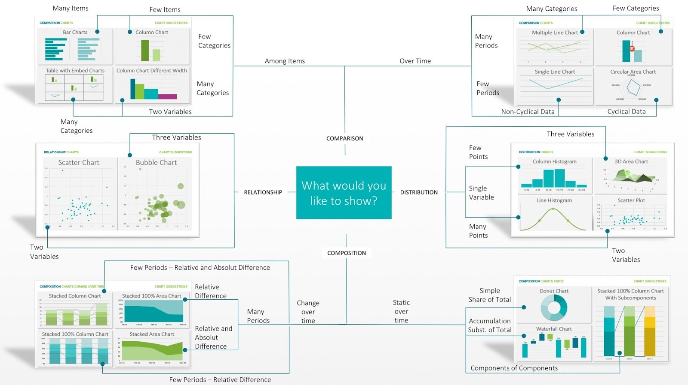

# R-introduction

## Start with basic codes

```
getwd()  #shows the working directory (path)

setwd() #set working directory

dir.create("data") #creates folder with the name data

dir.create("data/raw_data") # creates folder (raw_data) inside a folder (data)

# Learning basic codes ----------- 

# to set a variable 

x <- 2+2  (the same like this x=2+2, but better)


what type is my variable? 
x>-5
class(x)

-->"numeric"

x <- "Hello World"
class (x)

--> "charachter"

x<- TRUE
class(x)

--> "logical"

x <- 1+2i
class(x)

--> "colplex"

x <- charToRaw ("Hello World")
class(x)

-->"raw"
x <-data.frame(matrix(1:6,nrow = 2, ncol = 3))
class(x)

--> "data.frame"


6=6 # 6 is the variable 6

6==6 #6 is 6

6!=6 # 6 is not 6 

my_obj <-40 

data() # shows data already in R

View(data) # shows the data

class(dataname$variable) # shows what kind of variable this is

class(iris$Species) 

"factor"
```
# Plots 

### Basic plots
```
plot(iris)

boxplot(data=iris, x=iris$Petal.Length)


boxplot(data=iris, iris$Petal.Length~iris$Species)

stripchart()

hist()

qqnorm()

pairs()
```
## Installing packages for better plots (for example ggplot2)
```
go to packages --> install --> choose the one you want from CRAN
```
or 
```
install.packages("ggplot2")

install.packages("tidyverse")

```
install 2 packages (or more) at once
```
install.packages(c("readxl", "plotly"))

```

# Ggplot 2 

### Help function 
```
?ggplot
```

### For plotting, we need 
1. mapping
2. aesthetics
3. geom

```
ggplot(data = iris, mapping = aes(x = iris$Species, y = iris$Sepal.Length)) + geom_boxplot()
```
or 

```
ggplot(data = iris, mapping = aes(x = Species, y = Sepal.Length)) + geom_boxplot()

```
change color

fill = color in aes
```
ggplot(data = iris, mapping = aes(x = Species, y = Sepal.Length, fill = Species)) + geom_boxplot()
```
or with col = 
```
ggplot(data = iris, mapping = aes( Sepal.Length, Petal.Length, col = Species)) + geom_point()
```
Change the shape of the datapoints with shape = 
```
ggplot(data = iris, mapping = aes( Sepal.Length, Petal.Length, shape = Species)) + geom_point()
```

# Saving a plot 
First assign a plot name
```
plot1 <-ggplot(data = iris, mapping = aes( Sepal.Length, Petal.Length, size = Petal.Length)) + geom_point()
```
save it 

as PDF
```
plot1 + ggsave("plot1.pdf", height = 6, width = 8, units = "in", dpi = 300)
```
or tiff
```
plot1 + ggsave("plot1.tiff", height = 6, width = 8, units = "in", dpi = 300)

```
or png 
```
plot1 + ggsave("plot1.png", height = 6, width = 8, units = "in", dpi = 300)

```
`dpi = dots per inch`
(like pixels)

compress an image (for mailing etc., only for png or tiff)

```
plot1 + ggsave("plot1.tiff", height = 6, width = 8, units = "in", dpi = 300. compression = "lzw")
```


# `Question`

How to reshape the Data?

from long to wide 

tidyr::spread(iris, Species, 4)


# Normal-distribution 

With histogram, only for numeric values
```
hist(iris$Sepal.Length)
```
# Converting table into data.frame

trees<-data.frame(tress)

# Learning plotting with own choosen dataset
```
Trees<-data.frame(trees)

tree1<-ggplot(data = trees, mapping = aes(Height, Volume, col = Height)) + geom_boxplot()
tree2<-ggplot(data = trees, mapping = aes(Girth, Volume)) + geom_point()
tree3<-ggplot(data = trees, mapping = aes(Volume, Height, size = Girth, col = Girth)) + geom_point()
tree4<-ggplot(data = trees, mapping = aes(Girth, Volume)) + geom_line()
tree5<-ggplot(data = trees, mapping = aes(Girth, Height)) + geom_line()

```


# Set the repo
```
setRepositories() # in console
```

# Import dataset 

In Environment `Import Dataset`

# What kind of plot can i use for my data? 

`Google andrew abela chart guide`




