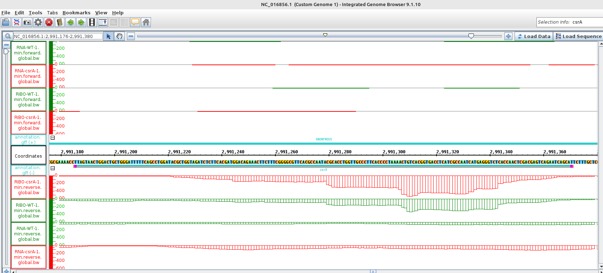
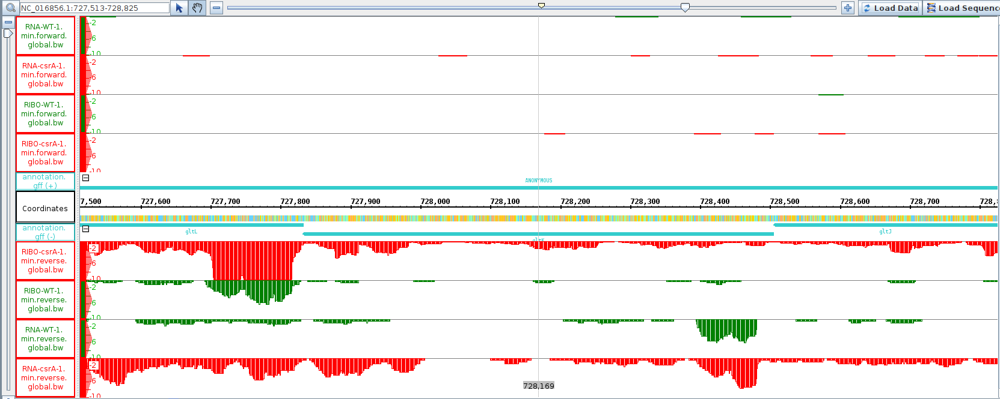

# Day 9

# RNA-seq and Ribo-seq

## Working with the data from the paper:

"Role of CsrA in stress responses and
metabolism important for Salmonella
virulence revealed by integrated
transcriptomics"
Anastasia H. Potts1¤a, Yinping Guo1¤b, Brian M. M. Ahmer2, Tony RomeoID1*

## Bacterial Ribo-seq data analysis by the HRIBO pipeline
%20In.png)

# Working with IGB

- Load for sequence: fasta-file
- Load for annotation: gff-file
- Load for coverage : bw-files

## Searching genes in IGB
## Task: Find the ORF rncoding csrA and some of it features

Location of the gene csrA : NC_016856.1:2,991,176-2,991,380

The locus tag for the gene encoding CsrS : STM14_3412

1. Start codon (canonical ATG or alternative GTG,TTG) : ATG
2. Its stop codon (TAG,TGA,TAA) : TAA
3. Its length in amino acids: 61 (-stop codon) 
4. Its SD (consensus AGGAGG at -7 to -4): AGGAG at -7
5. The name of the upstream(before) gene: STM14_3413/alaS
6. Do you think csrA is translated? Why?: Yes, as the coverage of the Ribo-seq covers the whole gene (the coverage fits the gene). UTRs clearly visible.

With the riborex-file you can see if the gene is translated or not and more information. 

## Task: Find a significantly differential expressed gene betweeen wt and scrA-mutant 

## `Gene gltK`

# Notes 
canonical start codon = ATG

non-canonical/alternate start codons =  GTG, TTG or other

